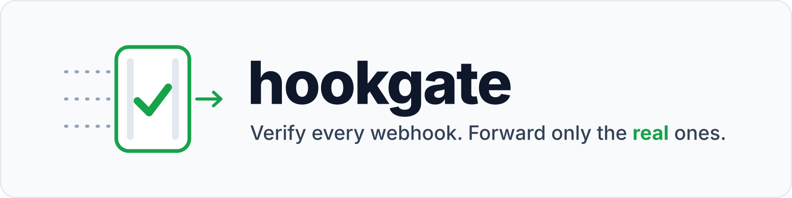
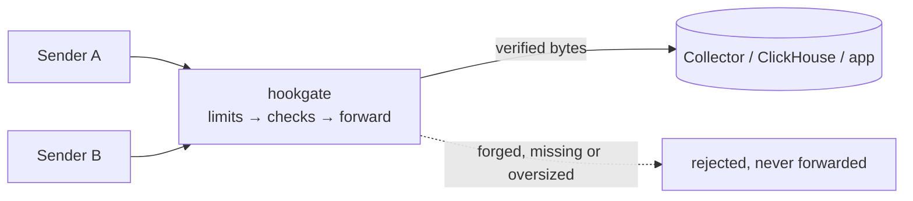

<picture>
  <source media="(prefers-color-scheme: dark)" srcset=".github/banner-dark.png">
  <source media="(prefers-color-scheme: light)" srcset=".github/banner-light.png">
  
</picture>

# hookgate

hookgate is a lightweight webhook gateway: a single static binary that checks each incoming webhook against its sender's signature or token and forwards only authentic requests, byte for byte, to your OpenTelemetry Collector, ClickHouse, Vector or any HTTP backend.

[Configuration](docs/configuration.md) · [Releases](https://github.com/mrrobertkent/hookgate/releases) · [Example](examples/hookgate.yaml) · [Security](SECURITY.md)

[](https://github.com/mrrobertkent/hookgate/actions/workflows/ci.yml)
[](https://github.com/mrrobertkent/hookgate/releases/latest)
[](https://pkg.go.dev/github.com/mrrobertkent/hookgate)
[](LICENSE)
[](https://scorecard.dev/viewer/?uri=github.com/mrrobertkent/hookgate)
[](https://github.com/mrrobertkent/hookgate/pkgs/container/hookgate)

## Why hookgate

Data pipelines are built to accept whatever arrives. A webhook endpoint in front of one is a public write path: anyone who finds the URL can insert rows. Most pipeline receivers check a static header at best, and few can verify an HMAC signature over the raw body, let alone the different scheme each sender uses.

hookgate closes that path:

- **Verifies per sender.** Static tokens and HMAC-SHA1/256/512 signatures in hex, base64 or base64url, with prefixes and multi-signature headers. Every check of a source must pass.
- **Fails closed.** A missing or too-short secret takes its own source offline (`503`), never open. Unknown config keys stop startup.
- **Forwards exactly what it verified.** The upstream receives the verified bytes and an allowlist of headers, nothing else, with retries across instances.
- **Costs almost nothing.** One ~16 MB distroless image, no database, no queue, Prometheus metrics built in.

## How it works



1. The request path selects a source; anything else is `404`.
2. Method, query string, encoding and body size are checked (`405`, `400`, `415`, `413`).
3. Every check of the source runs against the raw body. A failure returns `401` and nothing is forwarded.
4. The verified bytes go upstream. Transport errors and `5xx` responses retry on the next instance; the upstream's response goes back to the sender.

## Quick start

```sh
docker network create hookgate-demo
docker run -d --rm --name echo --network hookgate-demo ealen/echo-server   # stands in for your backend

cat > hookgate.yaml <<'EOF'
sources:
  - name: github
    path: /github
    checks:
      - hmac:
          header: X-Hub-Signature-256
          algorithm: sha256
          prefix: "sha256="
          secrets: [{env: GITHUB_WEBHOOK_SECRET}]
    forward:
      urls: ["http://echo/"]
EOF

docker run --rm --network hookgate-demo -p 8080:8080 -e GITHUB_WEBHOOK_SECRET=demo-secret-change-me \
  -v "$PWD/hookgate.yaml:/etc/hookgate/hookgate.yaml:ro" ghcr.io/mrrobertkent/hookgate
```

Send a signed request and a forged one:

```sh
BODY='{"zen":"Keep it logically awesome."}'
SIG=$(printf '%s' "$BODY" | openssl dgst -sha256 -hmac demo-secret-change-me -hex | awk '{print $NF}')

curl -i localhost:8080/github -H "X-Hub-Signature-256: sha256=$SIG" --data-binary "$BODY"     # 200, echoed by the backend
curl -i localhost:8080/github -H "X-Hub-Signature-256: sha256=$SIG" --data-binary "${BODY}x"  # 401, never forwarded
```

## Install

- **Container:** `ghcr.io/mrrobertkent/hookgate:<version>` (linux/amd64, linux/arm64). Pin a version or digest in production.
- **Docker Compose:** [examples/compose](examples/compose/) runs the pinned image with a health check, a restart policy and both ports on loopback behind your reverse proxy.
- **Binary:** download from [Releases](https://github.com/mrrobertkent/hookgate/releases) and check it with `sha256sum -c checksums.txt`.
- **Go:** `go install github.com/mrrobertkent/hookgate/cmd/hookgate@latest`

### Verify a release

Release archives and images carry SLSA build provenance signed with Sigstore; from v0.1.1, `checksums.txt` and the image are also signed with cosign. All signatures are keyless, issued to the release workflow.

```sh
# archive provenance (also attached to the release as hookgate_<version>.intoto.jsonl)
gh attestation verify hookgate_<version>_linux_amd64.tar.gz --repo mrrobertkent/hookgate

# checksums signature
cosign verify-blob checksums.txt --bundle checksums.txt.sigstore.json \
  --certificate-identity-regexp '^https://github.com/mrrobertkent/hookgate/.github/workflows/release.yml@refs/tags/v' \
  --certificate-oidc-issuer https://token.actions.githubusercontent.com

# image signature and provenance
cosign verify ghcr.io/mrrobertkent/hookgate:<version> \
  --certificate-identity-regexp '^https://github.com/mrrobertkent/hookgate/.github/workflows/release.yml@refs/tags/v' \
  --certificate-oidc-issuer https://token.actions.githubusercontent.com
gh attestation verify oci://ghcr.io/mrrobertkent/hookgate:<version> --repo mrrobertkent/hookgate
```

## Configuration

```yaml
listen: ":8080"            # webhooks
admin_listen: ":9090"      # /healthz, /readyz, /metrics — keep private
drain_delay: 20s           # keep serving after SIGTERM while the load balancer moves away

sources:
  - name: storage
    path: /storage/events
    max_body_bytes: 262144
    checks:                                   # all must pass
      - token:
          header: X-Webhook-Token
          secrets: [{env: STORAGE_TOKEN}]
      - hmac:
          header: X-Notification-Signature
          algorithm: sha256
          encoding: base64
          secrets:
            - env: STORAGE_SIGNING_SECRET
            - env: STORAGE_SIGNING_SECRET_NEXT  # rotation: both verify while set
              optional: true
    forward:
      urls: ["http://otel-collector:8088/storage/events"]
      resolve_all: true                       # every instance behind the name, random order
      pass_headers: [Content-Type]
      set_headers:
        Authorization: {env: UPSTREAM_TOKEN}  # the upstream's own credential
```

Secrets are always references (`env:` or `file:`), never literals. The full reference covers every key, default and status code: [docs/configuration.md](docs/configuration.md).

> [!TIP]
> Run `hookgate validate -config hookgate.yaml` in CI. It fails on unknown keys, impossible settings and unset secrets.

## Verification methods

| Check | Algorithms | Encodings | Extras |
|---|---|---|---|
| `token` | constant-time compare of a header with a shared secret | — | several secrets for rotation |
| `hmac` | HMAC-SHA1, HMAC-SHA256, HMAC-SHA512 over the raw body | hex, base64, base64url | `prefix` (`sha256=`), `separator` for multi-signature headers, several secrets for rotation |

## Recipes

<details>
<summary><b>Senders</b>: GitHub, Gitea, Bitbucket Cloud, Shopify, Linear, GitLab, iDrive e2</summary>

```yaml
# GitHub
- hmac: {header: X-Hub-Signature-256, algorithm: sha256, encoding: hex, prefix: "sha256=", secrets: [{env: GITHUB_SECRET}]}

# Gitea / Forgejo
- hmac: {header: X-Gitea-Signature, algorithm: sha256, encoding: hex, secrets: [{env: GITEA_SECRET}]}

# Bitbucket Cloud
- hmac: {header: X-Hub-Signature, algorithm: sha256, encoding: hex, prefix: "sha256=", secrets: [{env: BITBUCKET_SECRET}]}

# Shopify
- hmac: {header: X-Shopify-Hmac-Sha256, algorithm: sha256, encoding: base64, secrets: [{env: SHOPIFY_SECRET}]}

# Linear (hookgate checks the signature; Linear's webhookTimestamp is not checked)
- hmac: {header: Linear-Signature, algorithm: sha256, encoding: hex, secrets: [{env: LINEAR_SECRET}]}

# GitLab secret token
- token: {header: X-Gitlab-Token, secrets: [{env: GITLAB_TOKEN}]}

# iDrive e2 event notifications (custom header + signing secret)
- token: {header: X-E2-Token, secrets: [{env: E2_TOKEN}]}
- hmac: {header: X-E2-Notification-Signature, algorithm: sha256, encoding: base64, secrets: [{env: E2_SIGNING_SECRET}]}
```

</details>

<details>
<summary><b>Upstream</b>: OpenTelemetry Collector <code>webhookevent</code> receiver</summary>

Each verified request becomes one log record. Give every source its own receiver and exporter so one sender's backlog never blocks another. A runnable deployment with durable per-source queues, a ClickHouse variant and a crash test: [examples/otel-collector](examples/otel-collector/).

```yaml
# otel-collector config
extensions:
  bearertokenauth/hookgate:
    scheme: ""
    tokens: ["${env:HOOKGATE_UPSTREAM_TOKEN}"]
receivers:
  webhook_event/storage:
    endpoint: 0.0.0.0:8088
    path: /storage/events
    auth: {authenticator: bearertokenauth/hookgate}
```

```yaml
# hookgate
forward:
  urls: ["http://otel-collector:8088/storage/events"]
  resolve_all: true
  set_headers:
    Authorization: {env: HOOKGATE_UPSTREAM_TOKEN}
```

</details>

<details>
<summary><b>Upstream</b>: ClickHouse HTTP interface</summary>

One verified body becomes one row.

```sql
CREATE TABLE webhooks.github (received_at DateTime64(3) DEFAULT now64(3), body String)
ENGINE = MergeTree ORDER BY received_at;
```

```yaml
forward:
  urls: ["http://clickhouse:8123/?query=INSERT%20INTO%20webhooks.github%20(body)%20FORMAT%20RawBLOB"]
  set_headers:
    X-ClickHouse-User: {env: CLICKHOUSE_USER}      # a user that can only INSERT into this table
    X-ClickHouse-Key: {env: CLICKHOUSE_PASSWORD}
```

ClickHouse answers after the insert, so a `200` to the sender means the row is stored. Parse the JSON later with `JSONExtract*` or a materialized view.

</details>

<details>
<summary><b>Upstream</b>: Vector <code>http_server</code> source</summary>

```yaml
# hookgate
forward:
  urls: ["http://vector:8080/github"]
  pass_headers: [Content-Type, X-GitHub-*]
  set_headers:
    Authorization: {env: VECTOR_TOKEN}
```

Configure the Vector `http_server` source with `auth` for the same token and `acknowledgements` enabled so its response waits for the sink.

</details>

## Operations

- **Health:** `GET /healthz` on the admin port (process up), `GET /readyz` (`503` while draining). The image's `HEALTHCHECK` runs `hookgate healthcheck`.
- **Graceful rollout:** on SIGTERM hookgate keeps serving for `drain_delay`, then gives in-flight requests `shutdown_timeout`. Set your orchestrator's stop grace period above their sum.
- **Limits:** per-source body cap, server read and idle timeouts, `max_concurrent` in-flight requests (`503` beyond it).
- **Metrics:** `GET /metrics` exposes `hookgate_requests_total{source,outcome}`, `hookgate_upstream_attempts_total{source,result}`, `hookgate_source_ready{source}`, `hookgate_in_flight_requests` and `hookgate_draining`. Alert on `hookgate_source_ready == 0` and on `outcome="upstream_error"`.
- **Logs:** one JSON line per request with source, outcome, status, reason and timing. Secrets, signatures and bodies are never logged.

## Security

- Signatures are computed over the exact bytes received and compared in constant time (`hmac.Equal`, SHA-256 digests for tokens).
- Requests the signature does not cover are refused: query strings and compressed bodies by default.
- Only allowlisted headers reach the upstream; credentials the sender presented are dropped.
- Report vulnerabilities privately: [SECURITY.md](SECURITY.md).

## Comparison

| | hookgate | Reverse-proxy plugins | Pipeline receivers (OTel Collector, Vector) | Webhook command runners | Hosted gateways |
|---|---|---|---|---|---|
| Per-sender HMAC over the raw body, hex and base64 | ✅ | Plugin-dependent, usually one scheme | Header tokens, hex HMAC at best; or scripted checks | Hex HMAC | ✅ |
| Invalid requests never reach the backend | ✅ | ✅ | Some drop invalid events after accepting them | ✅ | ✅ |
| Forwards verified bytes to any HTTP upstream with retries | ✅ | ✅, without retry by verification outcome | — (they are the backend) | Runs a command instead | ✅ |
| Self-hosted, no database | ✅ | ✅ | ✅ | ✅ | — |
| Secret rotation with overlap | ✅ | Rarely | Varies | Partly | ✅ |

## Limitations

hookgate does one job. It does not:

- **Queue or persist.** The sender gets the upstream's answer. Put a durable upstream behind it (an [OpenTelemetry Collector with a persistent queue](examples/otel-collector/), ClickHouse, a broker) or rely on the sender's retries.
- **Check timestamps or deduplicate.** Schemes that sign a timestamp (Stripe, Slack, Standard Webhooks) are not supported yet.
- **Verify public-key or JWT signatures** (Discord, SendGrid, SNS) or answer subscription handshakes.
- **Terminate TLS.** Run it behind your reverse proxy.
- **Transform payloads.** Bodies are forwarded unchanged.

## Contributing

Issues and pull requests are welcome, especially new sender recipes and signature schemes. See [CONTRIBUTING.md](CONTRIBUTING.md).

## License

[Apache License 2.0](LICENSE)
