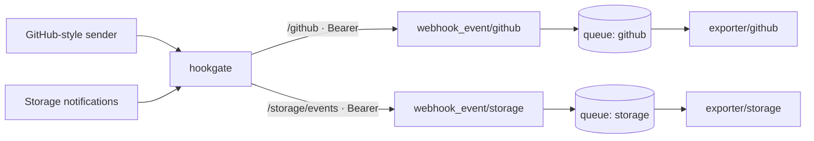

# hookgate + OpenTelemetry Collector with durable per-source queues

hookgate verifies each webhook; the Collector writes every verified event to an on-disk queue before it answers, then exports it. Each source has its own receiver, pipeline, exporter and queue.



| File | Purpose |
|---|---|
| [`docker-compose.yml`](docker-compose.yml) | hookgate, the Collector and a one-shot job that hands the queue volume to the Collector's user. Images pinned by version and digest. |
| [`hookgate.yaml`](hookgate.yaml) | Two sources: a GitHub-style hex HMAC, and a token plus base64 HMAC. Each forwards to its own receiver with `resolve_all` and a bearer token. |
| [`collector.yaml`](collector.yaml) | One `webhook_event` receiver per source behind `bearertokenauth`, one `debug` exporter per source with a `file_storage` queue (fsync). |
| [`collector.clickhouse.yaml`](collector.clickhouse.yaml), [`compose.clickhouse.yaml`](compose.clickhouse.yaml) | The same pipelines exporting to ClickHouse, one table per source. |

## Design

- **Separate receivers and exporters per source.** Every exporter owns a queue and its consumers. A source whose backend is slow, failing or full fills only its own queue; the other sources keep flowing. One shared exporter would make every source wait behind the slowest.
- **A `200` means queued on disk.** The receiver answers after the event is written to the source's queue, and `fsync: true` flushes it to the volume first. hookgate returns that answer to the sender. A full queue or a failed write returns `500`, hookgate returns it as a `5xx`, and the sender retries.
- **At-least-once.** Queued events survive a Collector crash or restart and are exported when it comes back. An event can be delivered twice (a retry after a lost response, a crash between export and dequeue), so make the backend tolerate duplicates or deduplicate downstream.
- **No `batch` processor.** It holds data in memory after the receiver has answered. Batch inside the exporter's `sending_queue` (`batch: {}`) when the backend needs it.
- **The token is the Collector's own credential.** hookgate drops the sender's headers and adds `Authorization: Bearer <UPSTREAM_TOKEN>`; the receivers refuse any request without it.

## Run it

Needs Docker with Compose, `curl` and `openssl`.

```sh
cat > .env <<EOF
GITHUB_WEBHOOK_SECRET=$(openssl rand -hex 32)
STORAGE_WEBHOOK_TOKEN=$(openssl rand -hex 32)
STORAGE_SIGNING_SECRET=$(openssl rand -hex 32)
UPSTREAM_TOKEN=$(openssl rand -hex 32)
CLICKHOUSE_PASSWORD=$(openssl rand -hex 32)
EOF
docker compose up -d --wait
```

Send a signed request and a forged one:

```sh
. ./.env
BODY='{"action":"opened","zen":"Keep it logically awesome."}'
SIG=$(printf '%s' "$BODY" | openssl dgst -sha256 -hmac "$GITHUB_WEBHOOK_SECRET" -hex | awk '{print $NF}')

curl -i localhost:8080/github -H "X-GitHub-Event: issues" -H "X-Hub-Signature-256: sha256=$SIG" --data-binary "$BODY"     # 200, queued
curl -i localhost:8080/github -H "X-GitHub-Event: issues" -H "X-Hub-Signature-256: sha256=$SIG" --data-binary "${BODY}x"  # 401, never forwarded

docker compose logs --no-log-prefix otel-collector | grep -A2 'Body:'
```

The Collector prints the accepted event once:

```
Body: Str({"action":"opened","zen":"Keep it logically awesome."})
Attributes:
     -> header.X-Github-Event: Slice(["issues"])
```

The storage source needs both its token and a base64 signature:

```sh
BODY='{"Records":[{"eventName":"s3:ObjectCreated:Put"}]}'
SIG=$(printf '%s' "$BODY" | openssl dgst -sha256 -hmac "$STORAGE_SIGNING_SECRET" -binary | openssl base64 -A)

curl -i localhost:8080/storage/events -H "X-Webhook-Token: $STORAGE_WEBHOOK_TOKEN" -H "X-Notification-Signature: $SIG" --data-binary "$BODY"  # 200
```

## Swap the exporter

Replace each `debug/<source>` exporter with your backend's exporter and keep its `sending_queue` and a `retry_on_failure` block. The ClickHouse variant does exactly that:

```sh
docker compose down
export COMPOSE_FILE=docker-compose.yml:compose.clickhouse.yaml
docker compose up -d --wait
```

Prove that a queued event survives a crash: stop ClickHouse so the event stays queued, kill the Collector with `SIGKILL`, then bring both back.

```sh
. ./.env
BODY='{"action":"closed"}'
SIG=$(printf '%s' "$BODY" | openssl dgst -sha256 -hmac "$GITHUB_WEBHOOK_SECRET" -hex | awk '{print $NF}')

docker compose stop clickhouse
curl -i localhost:8080/github -H "X-Hub-Signature-256: sha256=$SIG" --data-binary "$BODY"   # 200, queued on disk
docker compose kill -s SIGKILL otel-collector
docker compose start clickhouse otel-collector
sleep 10
docker compose exec clickhouse clickhouse-client --user otel --password "$CLICKHOUSE_PASSWORD" \
  -q "SELECT Body FROM webhooks.github"   # the event is there
```

The exporter creates the `webhooks` database and one table per source. In production, create the schema yourself and set `create_schema: false`.

## Clean up

```sh
docker compose down -v
```
